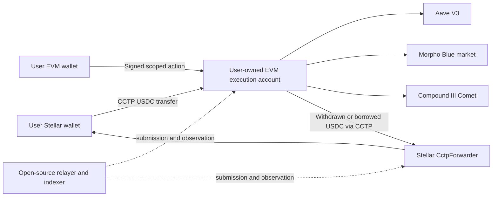

# Architecture: Stellar cross-chain lending

Decision record: [ADR-0001](../adr/0001-crosschain-lending-direction.md).

Each box labelled "execution account" is a separate instance per scope
`(owner, chain, protocol, marketScope, version)`, never a shared pool.

## Roles

| Actor | Can | Cannot |
|---|---|---|
| Stellar wallet | Authorize its own outbound CCTP burn | Grant EVM authority |
| EVM owner wallet | Sign intents; call the account directly at any time | Act on another user's account |
| Execution account | Hold USDC, collateral, supply claims and debt for one scope | Touch other scopes |
| Relayer | Submit bounded signed intents; pay gas | Change recipient, market, amount or fee cap |
| Registry / pause guardian | Pause new-risk actions per route | Move funds, block repay/withdraw/owner recovery |
| Destination protocol | Account for collateral, interest, debt, liquidation | Be overridden by Astrion state |

## Journeys

For each journey: custody (who holds funds at each step), authority (who
authorizes each step), debt and collateral (where they live), fees, recovery.

### 1. Lend from Stellar

1. User burns USDC on Stellar (Stellar wallet signs). Custody: in flight with CCTP.
2. Attestation, then mint to the user's execution account. Custody: account.
3. Signed intent supplies to the protocol. Custody: protocol claim owned by the account.
4. Close: owner withdraws, then a return burn delivers USDC to Stellar (journey 4).

- Fees: CCTP fee (bounded by `maxFee`), EVM gas (relayer-paid, capped fee), Stellar fees.
- Recovery: if the supply fails or expires, USDC stays in the account; the owner
  can execute directly. A burn cannot be cancelled; delivery continues.

### 2. Borrow to Stellar

1. Collateral already owned on EVM is moved into the account by the owner.
2. Signed intent posts collateral and borrows USDC. Debt and collateral: account.
3. Return burn delivers proceeds to Stellar. Debt stays on EVM.

- Liquidation risk stays on the EVM chain while proceeds travel. The borrow can
  complete while the return transfer is still pending.

### 3. Repay from Stellar

1. Burn on Stellar, mint to the account holding the debt.
2. Re-read debt immediately before execution; repay. Excess stays with the owner.
3. Withdraw collateral subject to protocol rules.

- Interest accrues during transit; a bridge ETA is never a liquidation buffer.
  Debt is never marked closed from a source transaction alone.

### 4. EVM → Stellar

Withdraw or borrow on Base/Ethereum, then burn to Stellar through Circle's
`CctpForwarder` with the final strkey in hook data. Malformed destinations fail
before burn. Returning to the original EVM market is also supported.

### 5. Full round trip from Stellar USDC only

Lending is journey 1 then 4. Borrowing needs eligible collateral; the baseline
uses collateral already on EVM. A future explicit USDC→collateral swap adds price
exposure and slippage checks. Lend-and-borrow USDC loops are not risk-free
yield, and users are never silently swapped into another asset.

## Lifecycle

`draft → source_submitted → source_confirmed → attestation_pending →
destination_minted → action_pending → completed` is a UI projection only. Each
bridge leg and each protocol action has its own on-chain identifier and
finality rule. Retryable failure, expired action and owner recovery are explicit
branches.

## Invariants

- CCTP mint replay protection is separate from intent nonce consumption.
- Mint to the user's account first, execute separately; a failed action leaves
  minted funds recoverable by the owner.
- Reconcile per transfer: canonical units, actual fee, received amount, retained
  dust, action consumption. In-flight funds are never counted twice.
- Backend status is never collateral value; positions are re-read from the
  protocol. Independent health factors are never combined.
- Validate source/destination domains, transmitter, token, recipient account,
  message/intent binding, finality and replay status. A valid transfer from an
  arbitrary sender does not authorize an action.
- Future Axelar commands must authenticate gateway, source chain, source
  contract, owner mapping, action hash and nonce.

## Evidence levels

Unit/mock, fork, testnet and production evidence are tracked separately; see
[ROADMAP](../ROADMAP.md#evidence-levels).

## Return path (EVM → Stellar)

`CctpReturnModule` plans an owner-signed burn of the account's USDC with
`TokenMessengerV2.depositForBurnWithHook`. The module is pinned like every
other module.
- `mintRecipient = destinationCaller = CctpForwarder` (manifest value).
- The final Stellar recipient is a strkey in hook data, validated **on-chain**
  (base32, checksum, version) before the burn.
- `minFinalityThreshold` is 1000 (fast) or 2000 (standard). `maxFee < amount`.
- The burn amount must be representable on Stellar after scaling by 10.
- The recipient is inside the signed action, so a relayer retry cannot redirect
  it. Borrow and withdraw results are separate intents from the return burn,
  so a delayed delivery never hides the debt. It stays on the protocol and in
  the lens.
- Off-chain preflight (trustline, Stellar balance, fee quote) runs before the
  intent is signed: `ops/crosschain/lib.sh` `require_stellar_trustline` and
  the SDK builders.
